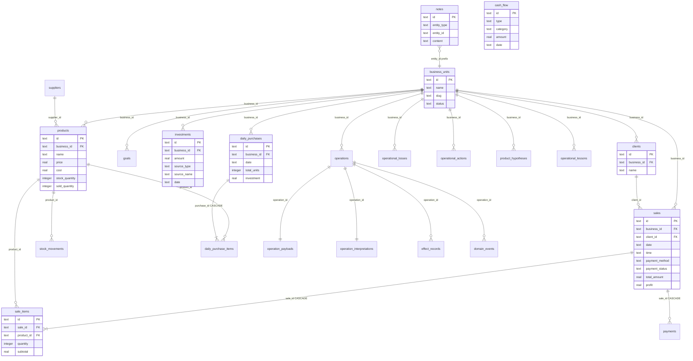

# ERD — Arquitetura SQLite Atual (Lucas Business OS)

**Sprint 4.0B — Somente documentação**  
**Base:** `data/lucas-business-os.db` + Drizzle schemas  
**Diagrama complementar:** ver também diagrama Mermaid abaixo

---

## 1. Diagrama entidade-relacionamento (textual)

```
┌─────────────────┐
│ business_units  │
│ PK: id          │
└────────┬────────┘
         │ 1
         │
    ┌────┴────────────────────────────────────────────────────────────┐
    │ *                                                               │
    ▼                                                                 ▼
┌───────────────┐              ┌──────────────┐              ┌──────────────┐
│   products    │              │    sales     │              │    goals     │
│ PK: id        │              │ PK: id       │              │ PK: id       │
│ FK: business  │              │ FK: business │              │ FK: business │
│ FK: supplier? │──┐           │ FK: client?  │──┐           └──────────────┘
└───────┬───────┘  │           └──────┬───────┘  │
        │ *        │                  │ 1        │
        │          │           ┌──────┴───────┐  │
        │          │           │ *            │  │
        │          │           ▼              │  │
        │          │    ┌──────────────┐      │  │
        │          └───►│  sale_items  │      │  │
        │               │ PK: id       │      │  │
        │               │ FK: sale     │      │  │
        │               │ FK: product  │◄─────┘  │
        │               └──────────────┘         │
        │                  │ 1                 │
        │                  │ *                 │
        │                  ▼                   │
        │           ┌──────────────┐             │
        │           │   payments   │             │
        │           │ PK: id       │             │
        │           │ FK: sale     │             │
        │           └──────────────┘             │
        │ *                                      │
        ▼                                        │
┌───────────────┐                                │
│stock_movements│                                │
│ FK: product   │                                │
└───────────────┘                                │
                                                 │
┌───────────────┐                                │
│   clients     │◄───────────────────────────────┘
│ PK: id        │
│ FK: business  │
└───────────────┘

┌───────────────┐     ┌─────────────────────┐     ┌──────────────────────┐
│  investments  │     │     cash_flow       │     │      settings        │
│ FK: business  │     │ (sem business_id!)  │     │ PK: key              │
└───────────────┘     └─────────────────────┘     └──────────────────────┘

┌───────────────┐
│   suppliers   │◄── FK opcional products.supplier_id (LEGADO / MORTO)
└───────────────┘

┌───────────────┐
│    reports    │  (MORTO — 0 registros)
└───────────────┘
```

### Bloco — Diário operacional (sync a partir de `notes`)

```
┌──────────────┐
│    notes     │  entity_type = operational_diary
│ PK: id       │  entity_id = {businessId}:{date}
│ content=JSON │
└──────┬───────┘
       │ syncDiaryToRelationalTables()
       ▼
┌──────────────────┐ 1──* ┌───────────────────────┐
│ daily_purchases  │──────►│ daily_purchase_items  │
│ FK: business     │       │ FK: purchase          │
│ UNIQUE(biz,date) │       │ FK: product?          │
└──────────────────┘       └───────────────────────┘

┌────────────────────┐  ┌─────────────────────┐  ┌────────────────────┐
│ operational_losses │  │ operational_actions │  │ product_hypotheses │
│ FK: business       │  │ FK: business        │  │ FK: business       │
└────────────────────┘  └─────────────────────┘  └────────────────────┘

┌────────────────────┐
│ operational_lessons│
│ FK: business         │
└────────────────────┘
```

### Bloco — Business Engine (auditoria / event sourcing)

```
┌──────────────┐ 1──1 ┌─────────────────────┐
│  operations  │──────► operation_payloads │
│ PK: id       │ 1──1 ┌──────────────────────────┐
│ FK: business │──────► operation_interpretations│
└──────┬───────┘
       │ 1
       │ *
       ├──────────────────► effect_records
       │
       └──────────────────► domain_events
```

---

## 2. Diagrama Mermaid (ERD simplificado)



---

## 3. Cardinalidades principais

| Relacionamento | Cardinalidade | On Delete |
|----------------|---------------|-----------|
| business_units → products | 1:N | — |
| business_units → sales | 1:N | — |
| clients → sales | 1:N | — |
| sales → sale_items | 1:N | CASCADE |
| sales → payments | 1:N | CASCADE |
| products → sale_items | 1:N | — |
| products → stock_movements | 1:N | — |
| daily_purchases → daily_purchase_items | 1:N | CASCADE |
| operations → effect_records | 1:N | — |
| notes → operational_* | 1:1 por (business, date) via sync | replace day |

---

## 4. Entidades isoladas (sem FK de saída relevante)

| Entidade | Observação |
|----------|------------|
| `cash_flow` | Sem `business_id`; isolada do grafo multi-operação |
| `settings` | KV global |
| `reports` | Morta |
| `suppliers` | Morta (1 registro seed) |

---

## 5. Dependências de leitura (fluxo de dados)

```
Vendas (sales) ──► Dashboard, CRM, Financeiro, Analytics, Metas
Diário (notes) ──► sync ──► Daily Purchases, Operational Intelligence ──► Dashboard prioridades
Investments + Cash Flow ──► Operator Finance ──► Financeiro
Products + Stock Movements ──► Estoque
Operations Engine ──► (futuro) Vendas via NLP
```

---

## 6. Uso deste ERD na Sprint 4.1

Este diagrama deve servir de base para:

1. Eliminar entidades 🔴 (`reports`, `suppliers`)
2. Corrigir `cash_flow` → adicionar `business_id`
3. Resolver duplicação `notes` ↔ tabelas operacionais
4. Mapear tipos SQLite → PostgreSQL por entidade
5. Definir schemas Postgres (`public` app + `audit` engine)

Ver detalhes completos em `CURRENT_DATABASE_AUDIT.md`.
